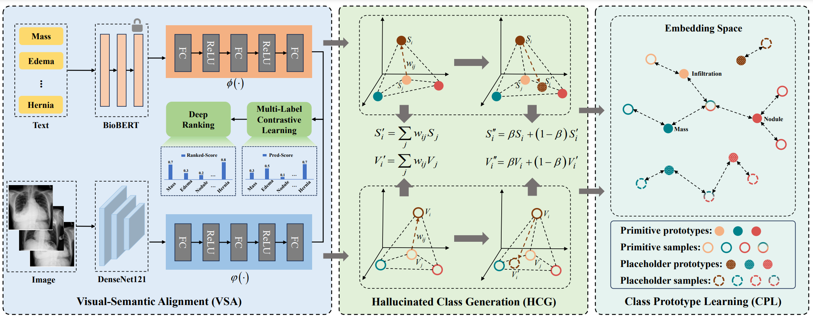

# PLZero
The codes for [**PLZero: Placeholder Learning Based Generalized Zero-Shot Learning for Multi-Label Chest Radiographs Recognition**].


## Dependencies

To clone all files:
```
git clone 
```
To install Python dependencies:

```
conda env create -f environment.yml
conda activate zsl
```
## Approach


## Data

#### **Training Dataset**   

We evaluated the proposed method on the NIH Chest X-ray dataset with a random split of 10 seen and 4 unseen classes.The dataset and official split can be obtain at https://nihcc.app.box.com/v/ChestXray-NIHCC


#### **Evaluation Dataset**   

**1. NIH ChestXrat14 Dataset**

NIH ChestXray14 dataset has 112,120 X-ray images with disease labels from 30,805
unique patients. Authors use natural language processing and the associated radiological reports to text-mine disease labels. There are 14 disease labels: Atelectasis, Cardiomegaly, Effusion, Infiltration, Mass, Nodule, Pneumonia, Pneumothorax, Consolidation, Edema, Emphysema, Fibrosis, Pleural Thickening and Hernia. 

The dataset and official split can be obtain at https://nihcc.app.box.com/v/ChestXray-NIHCC

**2. CheXpert Dataset**

The CheXpert dataset consists of chest radiographic examinations from Stanford Hospital, performed between October 2002 and July 2017 in both inpatient and outpatient centers. Population-level characteristics are unavailable for the CheXpert test dataset, as they are used for official evaluation on the CheXpert leaderboard.

The main data (CheXpert data) supporting the results of this study are available at https://aimi.stanford.edu/chexpert-chest-x-rays.

The CheXpert **test** dataset has recently been made public, and can be found by following the steps in the [cheXpert-test-set-labels](https://github.com/rajpurkarlab/cheXpert-test-set-labels) repository.

**3. ChestX-Det10 Dataset**

ChestX-Det10 is a subset of NIH ChestXray14, which is consisting of 3543
chest X-ray images with box-level annotations provided by 3 board-certified radiologists of 10
diseases/abnormalities, including Atelectasis, Calcification, Consolidation, Effusion, Emphysema,
Fibrosis, Fracture, Mass, Nodule and Pneumothorax. 

The ChestX-Det10 **test** dataset has recently been made public, and can be found by following the steps in the [chestX-det10-test-set-labels](http://resource.deepwise.com/xraychallenge/test_data.zip) repository.

## Training

To train the network, you run the following script by setting the data-root directory path of the downloaded dataset. 

    sh ./scripts/train.sh
  
## Zero-shot Inference

`sh ./scripts/test_chestxray14.sh ` 

`sh ./scripts/test_cheXpert.sh` 

`sh ./scripts/test_chestXDet10.sh`


## Model Checkpoints

We provide the models' checkpoints, which can be download from google drive with link: https://drive.google.com/file/d/1Jv1p3hYfdfDx02109QBr_BK5RnKIrJSh/view?usp=drive_link.


If you have any question, please feel free to contact.


